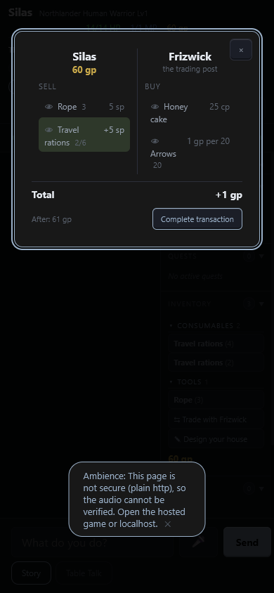
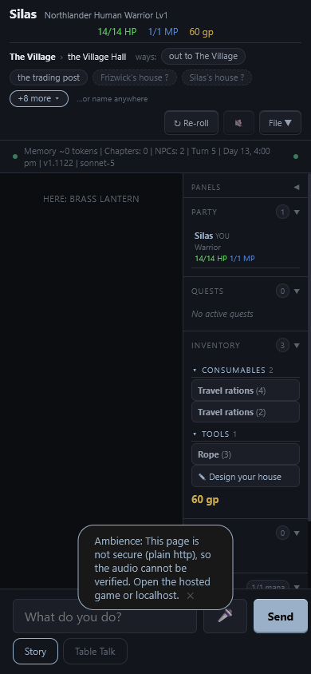
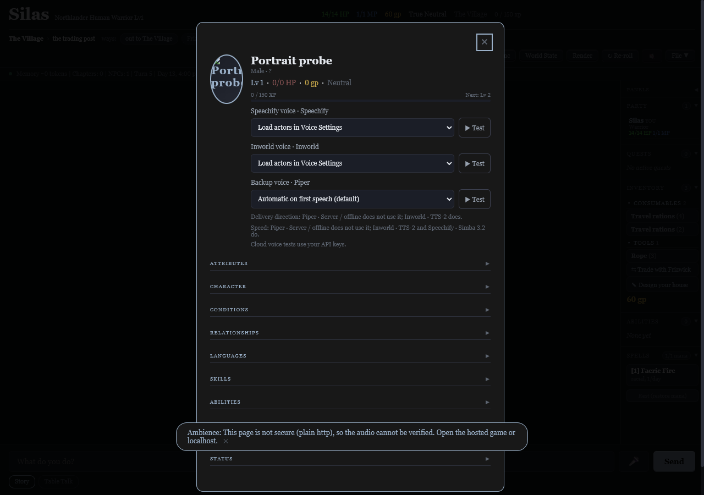

# Known-issues verification — 2026-10-02

Checked commit **27d4d6c2**, **v1.1122**, in the current C:/Projects/traffic-and-dragons checkout. User authorized verification, completion and archival, not runtime fixes or a push.

**76 existing Known issues rows reviewed: 36 verified complete, 40 retained.** Two open rows added: #591 graduates an already recorded lead; #592 records a broken manual verifier and its headless-fixture mismatch. “Retained” does not mean all 40 were independently reproduced: the table distinguishes observed failures, unfinished branch work and unverified items. Phone/car hardware (#19/#474), audible voice acceptance (#543), and deployed-account/library acceptance (#589) are not claimed.

## Evidence and limits

- [Full gate](VERIFY_known_issues_2026-10-02/full-gate.txt): ALL GREEN, 2,611 engine assertions and 93 standalone verifier suites. Four CI corpora v1238/v1258/v1271/v1276: no handler errors; byte-identical committed end states (replay-v*.txt).
- Targeted section receipts (section-*.txt): #481 137 assertions / 33 sections; #428 7; hearth 9; prompt caching 15; #407 8; #503 11; #505 4; #509 5; #510 5; #513 3; #514 5; #533 3; #535 2; #537 2. These supplement, not replace, the full gate. Counts above are this run's actual counts, even where old rows say more.
- Fresh mutation checks in disposable clones: #491 8/8 across two proof groups, #535 3/3, #537 2/2, #572/C10 2/2. Original engine files unchanged. Other historical sabotage totals in retained build records were not rerun or claimed as fresh evidence.
- [Read/run probe](VERIFY_known_issues_2026-10-02/probe.cjs) and [observations](VERIFY_known_issues_2026-10-02/probes.json): synthetic t5 fixtures reproduce #511, #517 (two cases), #518, #519 and #591. Real Princess t89 and Village t218 loaded from disk into memory only. Princess probe reconstructs the princess's pre-fusion pronouns in memory; it does not claim the historically fused save healed itself. No source save was written.
- Prompt captures from read-only saves: Village t218 stable 58,845 chars / SHA256 prefix 76fe43d02186, volatile 60,569 / 658931f51211; Princess t89 stable 60,174 / 81b76a241168, volatile 70,116 / 80e99f85df1f. Captures remain in the OS temporary evidence directory; no prompt-changing implementation was made, so no before/after prompt-change claim.
- [Browser verification script](VERIFY_known_issues_2026-10-02/browser.cjs): fresh isolated Chrome, fake origin, all external requests aborted, synthetic state, no credentials or live library/campaign writes. Counter at 900x760 and 390x844; Hall and malicious portrait at 1280x900 and 390x844. Screenshots inspected. The ordinary-rations adaptation is explicitly different from the original wanted-whistle fixture (see #592).
- [Car driver receipt](VERIFY_known_issues_2026-10-02/car/receipt.json): e8-paused-read passes through actual Car Mode/TTS controls with synthetic PCM and fake microphone. Spoken pause holds; tap resumes. This proves #484's context-resume mechanism, not Bluetooth/CarPlay sound quality.
- Audio planner/race checks prove selected asset and scheduling behavior only. No listening approval, iPhone background/transport behavior or long-duration WASM soak is claimed. For resource-related rows the tests exercise deferred accent loads and campaign stop, prompt cache flags, false crumb suppression and bounded record queues; this was not a new whole-program monotonic-resource audit.

## Failed or unavailable checks

1. Initial sandboxed Chrome launch failed with Page.enable: browser connection closed. Same isolated harness launched outside that sandbox; this is not counted as product evidence.
2. Original dev/qa-481-d5-d7-counter.js failed: AssertionError D7: two whistles sell for 1 gp, actual Total/—. Cause: wanted row max=1, second click clears. Filed #592. Ordinary stack floor/refusal and payable pair verified separately; no green claim for the original script.
3. An extra corpus_tagsoak_v1241 --check reported ENDSTATE DRIFT at byte 732 (expected 10,119 bytes, actual 13,399), with zero handler errors. Inspection shows its baseline is an **ignored, untracked local historical artifact**, removed from tracking by 444439aa, not one of CI's four oracles. [Field diff](VERIFY_known_issues_2026-10-02/tagsoak-diff.json) includes old XP, relationship and schema differences. No baseline was rewritten; the result does not establish a new regression.
4. An initial guessed corpus_playtest_v1240 path did not exist (ENOENT); corrected by reading CI's explicit fixture list. No test result attributed to that missing corpus.

## Row decisions

| Row | Outcome | Evidence or reason retained |
|---|---|---|
| #483 | Unverified / no landed fix established | No independent acceptance run for this row; current tracker does not claim a landed complete fix. Retained without guessing. |
| #484 | Verified complete | tests-484-earcon-pause.js plus car-driver e8-paused-read: synthetic narration stays paused after spoken pause and resumes on tap. |
| #485 | Unverified / no landed fix established | No independent acceptance run for this row; current tracker does not claim a landed complete fix. Retained without guessing. |
| #491 | Verified complete | Full gate replays corpus_playtest_v11078_gemini37_cache turn 2 verbatim: death, quest, key and 8 gp commit; markers strip. Sabotage 8/8. |
| #498 | Verified complete | tests-audit-voice.js: all three #498 checks pass; chosen paid/device voices add no false skip crumb, real fallback still reports. |
| #502 | Verified complete | tests-502-ambience-insecure-page.js: 7/7; real insecure Chrome page visibly gives the plain-http reason (browser screenshots). |
| #503 | Verified complete | #503: 11/11; Princess t89 loaded read-only with pre-fusion pronouns reconstructed in memory: King and princess remain separate. |
| #504 | Held / unfinished build | Held/unfinished branch work per current tracker; this pass verifies the shared checkout, not held branches. |
| #505 | Verified complete | #505: 4/4; sheeted Bram dies, all recognized death words survive the trim, Village harm refuses and dead-tired remains living. |
| #509 | Verified complete | #509: 5/5; imported/re-homed campaign moments follow the new id, foreign moments stay foreign. Stash marks remain separately open in #527(27). |
| #510 | Verified complete | #510: 5/5; missing-item and short-count sales preserve both purse and pack; the complete valid sale still lands. |
| #511 | Open / limited verification | Still broken: same-world footer after tavern arrival clears sublocation (synthetic village t5). |
| #512 | Unverified / no landed fix established | No independent acceptance run for this row; current tracker does not claim a landed complete fix. Retained without guessing. |
| #513 | Verified complete | #513: 3/3; silent arrival rotates presence before the next notes; departure evidence stays sealed and legacy worlds remain legacy. |
| #514 | Verified complete | #514: 5/5; none clears old sightings across thirty turns, a same-reply speaker reappears, companions and named casts remain correct. |
| #515 | Unverified / no landed fix established | No independent acceptance run for this row; current tracker does not claim a landed complete fix. Retained without guessing. |
| #517 | Open / limited verification | Still broken: 6 sp sale plus 1 gp purchase charges the same as purchase alone; GOLD:-3 coppers removes 3 gp (synthetic t5). |
| #518 | Open / limited verification | Still broken: one torch transferred as Torch x3 gives Bram three (synthetic t5). |
| #519 | Open / limited verification | Still broken: stow spear, swap to Frizwick, undo returns ok with spear in neither pack nor chest (synthetic village t5). |
| #520 | Unverified / no landed fix established | No independent acceptance run for this row; current tracker does not claim a landed complete fix. Retained without guessing. |
| #521 | Unverified / no landed fix established | No independent acceptance run for this row; current tracker does not claim a landed complete fix. Retained without guessing. |
| #522 | Unverified / no landed fix established | No independent acceptance run for this row; current tracker does not claim a landed complete fix. Retained without guessing. |
| #523 | Unverified / no landed fix established | No independent acceptance run for this row; current tracker does not claim a landed complete fix. Retained without guessing. |
| #525 | Held / unfinished build | Held/unfinished branch work per current tracker; this pass verifies the shared checkout, not held branches. |
| #526 | Unverified / no landed fix established | No independent acceptance run for this row; current tracker does not claim a landed complete fix. Retained without guessing. |
| #527 | Open / limited verification | Lead (26) confirmed on synthetic village t5 and graduated to #591. Other leads were not individually adjudicated in this pass. |
| #528 | Open / limited verification | Coverage gaps remain open; targeted green tests are not proof that all missing mutations are now guarded. |
| #529 | Unverified / no landed fix established | No independent acceptance run for this row; current tracker does not claim a landed complete fix. Retained without guessing. |
| #530 | Unverified / no landed fix established | No independent acceptance run for this row; current tracker does not claim a landed complete fix. Retained without guessing. |
| #531 | Unverified / no landed fix established | No independent acceptance run for this row; current tracker does not claim a landed complete fix. Retained without guessing. |
| #532 | Held / unfinished build | Held/unfinished branch work per current tracker; this pass verifies the shared checkout, not held branches. |
| #533 | Verified complete | #533: 3/3; Malrik the Constructor no longer breaks short-name/death tags, retrieval terms or future-event fingerprints. |
| #534 | Unverified / no landed fix established | No independent acceptance run for this row; current tracker does not claim a landed complete fix. Retained without guessing. |
| #535 | Verified complete | #535: 2/2 and sabotage 3/3; uppercase/mixed-case/spaced MERGE domains still require confirmation. |
| #536 | Held / unfinished build | Held/unfinished branch work per current tracker; this pass verifies the shared checkout, not held branches. |
| #537 | Verified complete | #537: 2/2 and sabotage 2/2; self-merge preserves Bram and warns; normal merge remains valid. |
| #538 | Held / unfinished build | Held/unfinished branch work per current tracker; this pass verifies the shared checkout, not held branches. |
| #539 | Held / unfinished build | Held/unfinished branch work per current tracker; this pass verifies the shared checkout, not held branches. |
| #540 | Held / unfinished build | Held/unfinished branch work per current tracker; this pass verifies the shared checkout, not held branches. |
| #541 | Unverified / no landed fix established | No independent acceptance run for this row; current tracker does not claim a landed complete fix. Retained without guessing. |
| #542 | Unverified / no landed fix established | No independent acceptance run for this row; current tracker does not claim a landed complete fix. Retained without guessing. |
| #543 | Open / limited verification | Five structural voice-preservation tests pass; audible replacement check and required Fable skim still outstanding. |
| #544 | Unverified / no landed fix established | No independent acceptance run for this row; current tracker does not claim a landed complete fix. Retained without guessing. |
| #545 | Unverified / no landed fix established | No independent acceptance run for this row; current tracker does not claim a landed complete fix. Retained without guessing. |
| #546 | Unverified / no landed fix established | No independent acceptance run for this row; current tracker does not claim a landed complete fix. Retained without guessing. |
| #560 | Open / limited verification | Original inline-tag cases pass, but #511 is reproduced and #529 remains open; place sequencing is not complete. |
| #561 | Verified complete | #407: 8/8 including A6; Chrome at 1280x900 and 390x844 visibly names Here: Brass lantern in the Hall; own-house count verified by fixture. |
| #562 | Verified complete | #481 B4 sections pass, including 11 keeper tests; stale tavern sightings expire while the recorded keeper trades only under the hours/presence rule. |
| #563 | Verified complete | #481 C1/C2 pass; read-only Village t218, simulated three-hour absence: return fact is village-local, no soul-tax lien, greeting at the door. |
| #564 | Verified complete | #481 C1/C2 pass; Village t218 return-note probe leaves map/history byte-identical and requests no LOCATION_STATE write. |
| #565 | Verified complete | #481 C3: final step and quest completion in one reply land without a false warning; existing closed quest remains closed. |
| #566 | Verified complete | #481 C4: numbered/unnumbered act and arc closes land; true title mismatch stays open with visible warning. Separate advice lead #527(12) remains. |
| #567 | Verified complete | #481 C5: foreign outfit/dynamic data is excluded at campaign boundaries; current-campaign data and lasting bonds stay intact. No within-campaign aging claim (Fable amendment recorded in todo_checkWithFable.md and f1265cd). |
| #568 | Verified complete | #481 C6: cake purchase exposes neither carried record nor note; explicit history question and Hall do; adventure behavior preserved. |
| #569 | Verified complete | tests-481-c7-record-names.js plus tests-516-deferred-queue.js pass: exact canonical names survive, free clerical prose stays guarded and deferred lines persist. |
| #570 | Verified complete | #481 C8: campaign-id moments stay current after rename; legacy own-name stamps move and foreign moments remain foreign. |
| #571 | Verified complete | #481 C9 and register-scrub coverage pass: canonical labels are exempt, free register words still caught, questLog traversed and own examples clean. |
| #572 | Verified complete | prompt caching split: 15/15, sabotage 2/2; default in-band suggestions cache only stable text, separate-suggestion mode retains volatile caching. |
| #573 | Verified complete | #481 C11: village crisis rule omitted, note newline preserved, start place visited, first encounter ends at sentence boundary and imported residents skip it. #483 remains separate. |
| #574 | Open / limited verification | Ordinary stow/undo tests pass, but hero-swap item destruction #519 is reproduced; do not close. |
| #575 | Open / limited verification | D2 original quantity/legacy-row fixtures pass; transfer/auto-take gaps in #518 remain, so broader item conservation is not verified. |
| #576 | Open / limited verification | D3 standalone gain/loss fixtures pass; paired transfer still creates three torches from one (#518), so completion remains held. |
| #577 | Open / limited verification | Ordinary paid-sale/expiry tests pass; discarding an item retires its want with no payment (confirmed #591). |
| #578 | Open / limited verification | Abbreviated gp/sp/cp fixtures and browser prices pass, but plural coppers and mixed trade fail (#517). |
| #579 | Verified complete | #481 D7 passes; isolated Chrome ordinary rations stack: lone 25 cp sale visibly refused, two-unit sale enables +1 gp at desktop/phone widths. Stale wanted-whistle QA filed #592. |
| #580 | Verified complete | #481 D8: two acquisitions queue in order, defined/stale items skip, sixth proposal refuses visibly without consuming its ask. |
| #581 | Open / limited verification | D9 ordinary refresh fixtures pass; re-keyed stash marks #527(27), transfer defects #518 and recorded coverage gaps #528 prevent a solid broader sign-off. |
| #582 | Verified complete | #428: 7/7 including D10; replacement clears old hero owed choices and delete marks while other owners remain unchanged. |
| #583 | Verified complete | Interior hearth defaults: 9/9 including E2; classified square/yard/green select beds at 06:00, 12:00, 16:40; hush and veto rules preserved. Sound selection verified, not listening. |
| #584 | Verified complete | tests-accent-layer.js passes: load completion under disabled/hidden/mic/paused gates cannot schedule accents; the spacing rule survives blocking. |
| #585 | Verified complete | tests-481-e4-campaign-switch.js passes: campaign activation stops TTS and clears replay text; repeat cannot speak the previous campaign. |
| #586 | Verified complete | Interior hearth defaults: 9/9 including E7; stale valid house selects hearth and re-asks, invalid profile remains silent. |
| #587 | Verified complete | tests-481-f1-campaign-folders.js passes: same-name campaigns export separately, legacy folders adopt safely, refused rename preserves original target. |
| #588 | Verified complete | #481 F2 tests plus Chrome malicious NPC portrait at desktop/phone widths: no injected script, no onerror attribute; unsafe image discarded. |
| #589 | Open / limited verification | Client slug/hash tests pass, including punctuation/accent names. Live Replace/Update against the deployed server was not exercised; no account/library writes authorized by this verification pass. |
| #590 | Verified complete | tests-438-folder-rename.js passes: post-copy removal failure names the complete destination and switches handle there; copy failure preserves source. |

## Rendered checks

## Reproduction

Run node audits/VERIFY_known_issues_2026-10-02/probe.cjs for the characterization observations (known-broken outcomes are deliberately reported, not fixed). Run node audits/VERIFY_known_issues_2026-10-02/browser.cjs for the isolated browser assertions; output defaults to OS temp, or set QA_OUT. The original car driver command is node dev/car-driver.js e8-paused-read. The source test suites and selected commands are named in the table and logs.

Completion statuses are committed before a separate byte-identical archive move, per the tracker contract. No game code/version change and no push.
